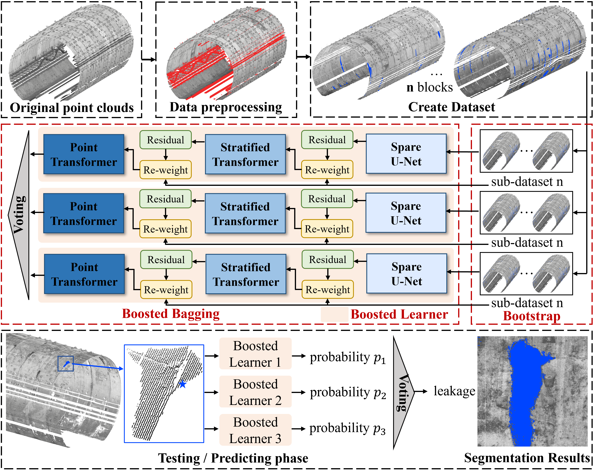

# BBE-Net

# Boosted bagging: A hybrid ensemble deep learning framework for point cloud semantic segmentation of shield tunnel leakage
<div align="center">
Jundi Jiang</a><sup>1</sup>, Yueqian Shen</a><sup>1</sup>, Jinhu Wang</a><sup>2</sup>, Yufu Zang</a><sup>3</sup>, Weitong Wu</a><sup>1</sup>, Jinguo Wang</a><sup>1</sup>, Junxi Li</a><sup>1</sup>, Vagner Ferreira</a><sup>1</sup>

<div align="center">
  
</a><sup>1</sup>School of Earth Sciences and Engineering，Hohai University， 
  
</a><sup>2</sup>Institute for Biodiversity and Ecosystem Dynamics (IBED)， University of Amsterdam， 

</a><sup>3</sup>School of Remote Sensing & Geomatics Engineering, Nanjing University of Information Science & Technology




<div align="left">

# Acknowledgment 	
<div align="left">
  
We adapt the codebase of [Pointcept](https://github.com/Pointcept/Pointcept), which  is a powerful and flexible codebase for point cloud perception research. Please refer to [Pointcept](https://github.com/Pointcept/Pointcept) if you need more information.

## Create your virtual environment
### Requirements
<div align="left">

We recommend using [anaconda](https://www.anaconda.com/) or [miniconda](https://docs.anaconda.com/miniconda/) to build your virtual environment.

Please refer to [requirements](./requirements.txt).

## Notes
#### Multi-GPU training

If you want to perform multi-GPU training, please make the following code modification:

:one:

```
cd ~/anaconda3/envs/pointcept/lib/python3.8/site-packages/pointops-1.0-py3.8-linux-x86_64.egg/pointops/utils.py
```
find **knn_query_and_group** function, Under line **17**, add:
```
idx = idx.to(xyz.device)
```
:two:
```
cd ~/anaconda3/envs/pointcept/lib/python3.8/site-packages/pointops-1.0-py3.8-linux-x86_64.egg/pointops/interpolation.py
```
find **interpolation** function, Under line **19**, add:
```
new_feat = new_feat.to(feat.device)
weight = weight.to(feat.device)
```
:three:
```
cd ~/anaconda3/envs/pointcept/lib/python3.8/site-packages/pointops-1.0-py3.8-linux-x86_64.egg/pointops/grouping.py
```
find **grouping** function, Under line **54**, add:
```
mask = mask.to(grouped_xyz.device)
```

# Training
#### step 1
```
conda activate your/env/name
```
#### step 2
```
cd your/your/codebase/path
```
#### step 3
```
python3 train_boost.py -c ./configs/ensemble/boost_model_v2.py
```
The training log and checkpoint can be viewed in the [exp](./exp) in the config file
#### step 4
```
python3 train_ensemble.py -c ./configs/ensemble/ensemble_train_v2.py
```
You need to set the config file and checkpoint path for each boost_model in ensemble_info

# Test
```
python3 test_ensemble.py -c ./configs/ensemble/ensemble_test_v2.py
```

## Citation
